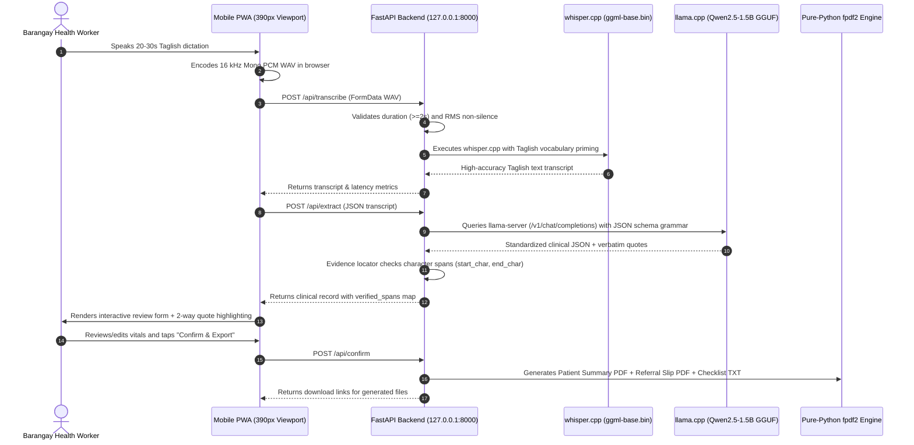

# OfflineDoc Technical Architecture

## 1. System Philosophy: 100% On-Device & Zero Cloud

OfflineDoc is built for extreme environments: remote Philippine sitios with zero cellular signal, spotty battery life, and harsh tropical conditions.

The architecture adheres to three non-negotiable principles:
1. **Zero Remote Dependencies:** Zero cloud AI APIs, zero external CDN scripts, zero Google Fonts, and zero telemetry. The application functions flawlessly with Wi-Fi disabled and mobile data turned off.
2. **Strict Budget Hardware Limits ($\le 1.2$GB RAM):** The entire stack is optimized to fit within the physical memory constraints of budget Android devices (₱6,000–₱8,000 phones) and entry-level laptops without triggering kernel `LowMemoryKiller (SIGKILL)` crashes.
3. **Clinical Safety & Verbatim Grounding:** To eliminate hallucinations, every extracted clinical field must be grounded in an exact or fuzzy character span within the original voice transcript. Unstated facts are strictly preserved as `null`.

---

## 2. End-to-End System Diagram

---

## 3. Pipeline Stages & Implementation Details

### Stage 1: Browser-Based Resampling & Audio Capture (`web/recorder.js`)
- Standard phone microphones record in varying container formats (AAC, WebM, OGG) at 44.1 kHz or 48 kHz stereo.
- Whisper.cpp requires 16,000 Hz, 16-bit linear PCM mono WAV.
- Rather than requiring a heavy system `ffmpeg` binary installation, `OfflineDoc` performs native downsampling directly in the browser via `AudioContext({ sampleRate: 16000 })`.
- Collects raw Float32 samples, calculates real-time RMS for the UI level bar, and encodes a valid 44-byte RIFF header upon completion.

### Stage 2: Audio Validation (`app/validate.py`)
To prevent crashes and compute wastage on invalid mic taps:
1. **Header Validation:** Confirms valid 44-byte RIFF/WAVE header and standard PCM format code (`0x0001`).
2. **Duration Minimum:** Rejects clips under 2.0 seconds with a polite health-worker prompt (*"Napakabilis ng boses. Paki-ulit po"*).
3. **RMS Non-Silence Threshold:** Calculates root-mean-square amplitude across 16-bit samples; rejects pure silence or accidental pocket taps.

### Stage 3: Taglish Speech-to-Text (`app/transcribe.py`)
- **Engine:** `whisper.cpp` using `ggml-base.bin` (~142 MB multilingual).
- **Taglish Vocabulary Priming:** Standard English models hallucinate phonetic English gibberish when hearing Tagalog medical speech. OfflineDoc injects an initial prompt into the decoding loop:
  `--initial-prompt "Ito ay konsultasyon sa Barangay Health Station: pasyente, lagnat, ubo, sipon, BP, blood pressure, over, paracetamol, reseta, RHU, doktor, gamot, Sitio, Purok."`
- This stabilizes mixed Filipino-English vocabulary transitions without requiring large, heavy speech models.

### Stage 4: Constrained Schema Extraction (`app/extract.py`)
- **Engine:** `llama.cpp` `llama-server` on `127.0.0.1:8081`.
- **Model:** `Qwen2.5-1.5B-Instruct-Q4_K_M` (~980 MB) or `Llama-3.2-1B-Instruct-Q4_K_M` (~800 MB).
- **JSON Schema Grammar:** The model's sampling logits are strictly constrained by the visit schema definition. Output is guaranteed to be syntactically valid JSON.
- **Rule Enforcement:**
  - Translates Taglish descriptions into standardized clinical terminology (*"masakit ang ulo"* $\rightarrow$ *"Headache"*).
  - Unstated fields MUST be `null`. The model is strictly instructed never to extrapolate or guess.
  - Automatically identifies whether an RHU doctor referral is required.

### Stage 5: Verbatim Evidence Grounding (`app/evidence.py`)
- For every non-null clinical field extracted by the LLM, the system verifies that the quote exists verbatim in the transcript.
- Uses a multi-tier matching strategy:
  1. Exact substring match.
  2. Case-insensitive regex match.
  3. Normalized fuzzy token span match.
- Output: Returns `{ start_char, end_char, status: "verified" | "unverified" }`.
- Front-end interaction: Tapping an input field highlights its quote in the transcript viewer; tapping a transcript highlight scrolls to and focuses the input field.

### Stage 6: Unicode Document Generation (`app/export_pdf.py` & `app/checklist.py`)
- **Engine:** Pure Python `fpdf2` with bundled Unicode TrueType Font (`web/fonts/font.ttf`).
- **No Latin-1 Crashes:** Properly renders Philippine peso signs (`₱`), Spanish names with `ñ` (e.g. *Niño*, *Parañaque*), and smart punctuation without encoding failures.
- **Generates:**
  1. **Visit Summary PDF:** Clean medical record for the Barangay logbook.
  2. **Barangay Referral Slip PDF:** Conditional official referral letter for the municipal doctor, featuring triage urgency badge (URGENT / ROUTINE) and signature attestation lines.
  3. **Checklist TXT:** Follow-up tasks (*Talaan ng Gawain*) formatted for quick SMS or paper reference.

---

## 4. Hardware & Memory Budget Analysis

The entire runtime is engineered to execute within 1.2 GB of system RAM:

| Subsystem | Binary / Model File | Working RAM Footprint | Notes |
|---|---|---|---|
| **whisper.cpp** | `ggml-base.bin` (142 MB) | ~350 MB | Multi-threaded CPU inference |
| **llama.cpp** | `Qwen2.5-1.5B-Q4_K_M` (980 MB) | ~780 MB | 4-bit quantized GGUF |
| **Python FastAPI** | Uvicorn worker | ~45 MB | Async non-blocking endpoints |
| **Mobile Web PWA** | Vanilla HTML/CSS/JS | ~25 MB | Zero client-side frameworks |
| **Total Footprint** | | **~1,200 MB ($\le$ 1.2 GB)** | **Fits comfortably on 3GB+ Android devices** |

---

## 5. Mobile PWA vs. Native Android NDK Evaluation

During early design audits, compiling custom native C++ Android NDK binaries directly inside an APK was evaluated and formally dropped in favor of the Mobile PWA architecture:

1. **Android LowMemoryKiller Risks:** Running simultaneous C++ Whisper and Llama inference threads inside Android's restricted app process memory causes the Linux kernel to trigger `SIGKILL (OOM)` on budget devices.
2. **Missing Native PDF Stack:** Android lacks a lightweight native equivalent to `fpdf2` without heavy JVM PDF dependencies.
3. **Cross-Platform Hotspot Flexibility:** The Mobile PWA architecture allows a single offline BHW laptop or phone to act as an offline Wi-Fi hotspot, allowing multiple health workers to access the documentation assistant simultaneously via browser.
