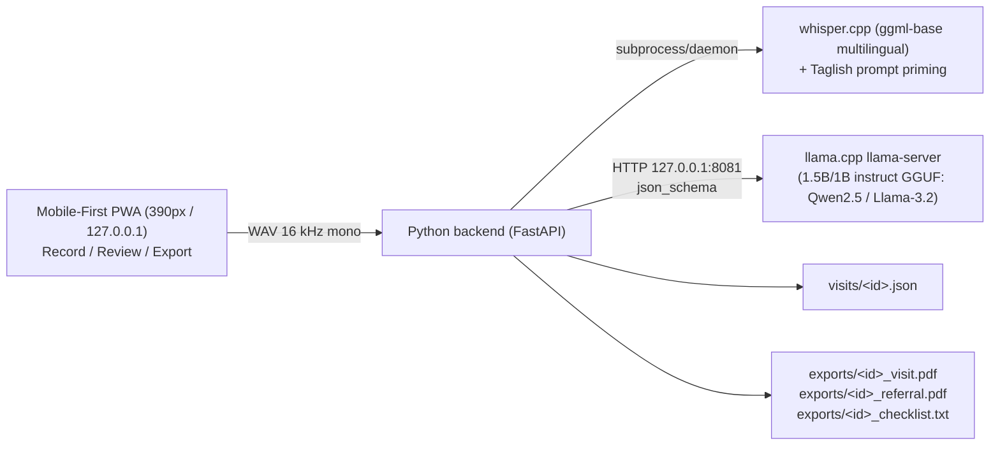

# IMPLEMENTATION_PLAN.md

**Status:** APPROVED v2 (Oct 9, ~6:10 PM PHT). Derived from `OFFICIAL_BRIEF.md`, `RULEBOOK.md`, and the approved `PROJECT_CONTRACT.md`. All additions (Taglish, Barangay Referral Slip, Mobile PWA layout) are confirmed.

**Owners:** Brian (Product + Demo), Andrei (Build), Christian (Quality).
**Time left:** ~16 hours. Hard deadline 10:00 AM Oct 10 (R14, R15). Internal code freeze 8:30 AM.

---

## 0. How to read this plan

- **Part A** is for developers: the timeline, who owns what, and the things only people can do (hardware tests, decisions, recording, pitching, submitting).
- **Part B** is for coding agents (Devin, Claude, Antigravity): guardrails plus task cards with inputs, outputs, and acceptance criteria. Hand an agent one card at a time.
- Slices S0 to S8 are shared IDs used in both parts and in `CHECKLIST.md`.

---

## 1. Target architecture



| Decision | Choice | Why |
|---|---|---|
| Backend | Python 3.11+, FastAPI + Uvicorn, bound to `127.0.0.1` only | Contract: Python backend, local only |
| Speech | whisper.cpp, `ggml-base.bin` (multilingual ~142MB) with `--initial-prompt` Taglish vocabulary priming | Supports mixed Filipino-English dictation without phonetic corruption |
| LLM | llama.cpp `llama-server`, 1B–1.5B instruct GGUF at Q4_K_M (`Qwen2.5-1.5B-Instruct` or `Llama-3.2-1B-Instruct` ~800MB) | Fits $\le$ 1.2GB total memory budget for budget ₱6,000 Android phones; fast token generation |
| Audio capture | Record WAV 16 kHz mono **in browser** (`AudioContext({sampleRate: 16000})` + AudioWorklet) | Native browser resampling; zero system ffmpeg dependency |
| Uploaded audio | Accept `.wav` only unless ffmpeg is found on PATH; show a clear message otherwise | Keeps fresh-clone install small |
| Storage | One JSON file per visit in `data/visits/`; audio deleted after transcription by default | Contract: no database |
| PDF | `fpdf2` (pure Python) with bundled Unicode TTF font (`Inter.ttf` or `DejaVuSans.ttf`) | Works offline; generates Visit Summary AND Barangay Referral Slip without encoding crashes |
| Frontend | Vanilla HTML/CSS/JS **Mobile-First PWA** (390px viewport, manifest.json, all assets local) | Touch-friendly for phone screens in airplane mode; zero CDN/Google Fonts (R6) |

### Repo layout (target)

```text
OfflineDoc/
  README.md  DISCLOSURES.md  ARCHITECTURE.md  DEMO_RUNBOOK.md  SUBMISSION.md
  OFFICIAL_BRIEF.md  RULEBOOK.md  PROJECT_CONTRACT.md  IMPLEMENTATION_PLAN.md  CHECKLIST.md  playbook.md
  requirements.txt  .gitignore  config.example.toml
  scripts/  setup_models.ps1  start.ps1  smoke_test.py
  app/      main.py  config.py  validate.py  transcribe.py  extract.py  evidence.py
            schema.py  storage.py  export_pdf.py  checklist.py
  web/      index.html  styles.css  app.js  recorder.js  manifest.json  fonts/
  eval/     visits/*.json (synthetic Taglish scripts + gold labels)  audio/ (synthetic clips)
            run_eval.py  results/ (raw outputs, committed)
  tests/    test_validate.py  test_evidence.py  test_schema.py  test_export.py
  models/   (gitignored; filled by setup_models.ps1)
  bin/      (gitignored; whisper.cpp and llama.cpp binaries)
  data/     (gitignored; visits and exports)
```

### Visit record schema (v2)

Every field is `{ "value": <type or null>, "evidence": <exact transcript quote or null> }`. Unstated values are strictly `null`, never guessed.

| Field | Type | Notes |
|---|---|---|
| `patient_label` | string | Alias or initials only in demo (synthetic) |
| `visit_date` | string (ISO date) | Default to today in UI; LLM must not invent |
| `location` | string | Barangay / sitio |
| `age_years` | number | |
| `sex` | enum `female`/`male` | |
| `chief_complaint` | string | Standardized English clinical description |
| `symptoms` | string[] | Standardized clinical terms |
| `vitals.bp` | string `"120/80"` | Range-checked in S3; flagged if $\ge$ 140/90 |
| `vitals.temp_c` | number | Range 34 to 43; flagged if $\ge$ 38.0 |
| `vitals.pulse_bpm` | number | Range 30 to 220 |
| `vitals.resp_rate` | number | Range 6 to 60 |
| `vitals.weight_kg` | number | Range 1 to 250 |
| `medications_given` | string[] | As stated; no autonomous dosing advice generated |
| `advice_given` | string[] | What the BHW said they advised |
| `follow_up` | `{task, due}`[] | Populates the *Talaan ng Gawain* checklist |
| `referral` | `{facility, reason, urgency}` or `null` | Populates the **Barangay Referral Slip** if patient needs RHU doctor |

The schema is shared across `app/schema.py` (JSON Schema for llama-server), the Review form, the PDF exporters, and the eval harness.

---

## 2. Slices and timeline (PHT)

| Slice | Window | Goal | Lead | Gate / exit criterion |
|---|---|---|---|---|
| S0 Offline smoke test | 5:15 to 6:30 PM | Binaries + 1.5B model + multilingual Whisper run on laptop in airplane mode | Andrei (exec), Christian (evidence) | Sub-10s transcription & sub-10s extraction |
| S1 Skeleton + Mobile Record | 6:30 to 8:30 PM | Local server, Mobile PWA Record screen, WAV capture, validation, transcription endpoint | Andrei + agent | Speak Taglish in mobile UI $\rightarrow$ transcript appears |
| S2 Taglish Extraction | 8:00 to 10:00 PM | Schema-constrained extraction; Taglish quote grounding and evidence verification | Andrei + agent | Valid JSON with verbatim Taglish quotes for 5/5 samples |
| S3 Mobile Review | 9:30 PM to 12:00 AM | Touch review form + quote highlight, out-of-range flags, Confirm button | agent + Brian (UX) | Mobile card layout: field $\leftrightarrow$ quote interactive linking |
| S4 Export & Referral Slip | 11:30 PM to 1:30 AM | PDF visit report + Barangay Referral Slip + checklist.txt; JSON saved | agent | Both PDFs generate cleanly with bundled TTF font |
| S5 Fallbacks + offline badge | 1:00 to 2:30 AM | Typed notes, WAV upload, labeled sample mode, offline badge, error UI | agent + Christian | Clear, honest messaging across all failure paths |
| S6 Eval | 10:00 PM to 3:00 AM (parallel) | Synthetic Taglish visits, eval script, raw results committed | Christian + agent | `eval/results/` committed; reproducible numbers |
| S7 Docs + fresh-clone test | 2:30 to 5:00 AM | README, DISCLOSURES, ARCHITECTURE, DEMO_RUNBOOK, SUBMISSION | agent drafts, Andrei/Brian edit, Christian tests | Christian recreates from clean clone (R16) |
| S8 Polish & Rehearsal | 5:00 to 7:00 AM | Demo video, phone-to-projector checks, timed pitch rehearsal | Brian + team | 5-minute timed live demo pitch green |
| Video + post | 7:00 to 8:30 AM | ~1-minute demo video, X/LinkedIn post (#AppBuildersPH @Devin) | Brian | Post live, URL copied |
| Freeze + submit | 8:30 to 9:30 AM | Final commit, repo public, single submission on Cerebral Valley | Brian + Andrei | Confirmation by 9:30 AM (30 min buffer) |

### 2.1 S0 go/no-go criteria (measured on the demo laptop, Wi-Fi off)

| Check | Pass | Fallback if it fails |
|---|---|---|
| whisper.cpp transcribes 25s Taglish clip | $\le$ 10s wall time, readable text | `tiny` multilingual; refine `--initial-prompt` |
| Taglish accuracy on 5 scripted clips | Key facts (vitals, names, meds) captured in $\ge$ 4 of 5 | Speak clearly; adjust vocabulary primer |
| llama-server extraction with 1.5B GGUF | Valid schema JSON in $\le$ 12s | 1B model (`Llama-3.2-1B-Instruct`) |
| Total turnaround (Audio $\rightarrow$ Filled form) | $\le$ 22s total | Compact schema; temperature 0.0 |

Christian records the raw timings in `eval/results/s0_smoke.md`. Brian decides Go / Adjust / Switch at 5:15 PM. Every hour after that makes a concept switch more expensive.

---

## Part A: Developer track

### A1. Before writing code (3:05 to 3:30 PM)

- [ ] Brian: approve or change `PROJECT_CONTRACT.md` (barangay health worker framing, RECOMMENDED additions stay `Next`).
- [ ] Brian: screenshot the official list at appbuildersph.com/hackathon showing all 3 members (R1). Save to `docs/evidence/` (gitignored if it shows personal data; keep a local copy).
- [ ] Brian: post Q1 to Q5 from `RULEBOOK.md` in Telegram; log answers in `OFFICIAL_BRIEF.md`.
- [ ] Andrei: first commit now (contract, rulebook, brief, plan, checklist). The repo currently has **no commits**, which is good evidence for R3. Keep the GitHub repo private until docs are clean, but make it public by 8:30 AM at the latest.
- [ ] Andrei: add `.gitignore` for `models/`, `bin/`, `data/`, `.venv/`, `*.wav` outside `eval/audio/`.
- [ ] Everyone: agree that every AI tool used is logged in `DISCLOSURES.md` as it is used (Devin, Claude, Antigravity, ChatGPT if any).

### A2. Things only people can do

| Task | Owner | When |
|---|---|---|
| Download binaries and models onto the demo laptop; test in airplane mode | Andrei | S0 |
| Record 5 scripted S0 clips (English) + 5 Taglish clips | Christian | S0 |
| Write 10 to 20 synthetic visit scripts with gold labels (no real patients) | Christian, agent drafts | S6 |
| Record synthetic eval audio (team voices) | Christian + Brian | S6 |
| UX review of Review screen with Maria's flow in mind | Brian | S3 |
| Decide on S8 additions at 2:00 AM based on status | Brian | S8 |
| Fresh-clone test on a second machine or clean folder | Christian | S7 |
| Write the "why local" answer and the pitch | Brian | S7 |
| Record demo video, post on X/LinkedIn with tags | Brian | 6 to 8 AM |
| Final submission on Cerebral Valley | Brian (Andrei double-checks) | by 9:30 AM |
| Demo Day: laptop with models preinstalled, charger, HDMI/USB-C adapter, headset mic | Brian + Andrei | Oct 10 |

### A3. Code-review rules for developers

- Every agent PR is reviewed by a human before merge. Check: no network calls, no new dependency without a `DISCLOSURES.md` line, tests pass.
- Andrei owns `main`. Short-lived branches per slice (`s1-record`, `s2-extract`, ...).
- Commit small and often; history is evidence (R3). Messages like `S2: add evidence verification`.
- Never paste real patient data into any AI tool, prompt, test, or fixture.

### A4. Demo laptop prep (do once S4 works)

- [ ] Models in `models/`, binaries in `bin/`, venv built, `scripts/start.ps1` launches everything.
- [ ] Browser mic permission granted for `http://127.0.0.1:<port>` (Chrome or Edge).
- [ ] Test the full flow with Wi-Fi **off** and the laptop **on battery** (slower CPU).
- [ ] Power plan set to High performance; disable sleep and notifications.
- [ ] Pre-recorded backup WAV and a typed-notes fallback ready; both labeled in the UI.

---

## Part B: Agent track

### B1. Guardrails (paste into every agent session)

```text
You are working on OfflineDoc, a hackathon project. Rules you must follow:
1. All AI inference runs locally (whisper.cpp, llama.cpp). Never add calls to cloud AI APIs,
   telemetry, CDNs, Google Fonts, or any remote URL in app code. The app must work with networking off.
2. Bind servers to 127.0.0.1 only.
3. Never use real patient data. All fixtures and examples are synthetic and labeled as such.
4. Never invent metrics or benchmark numbers. Only numbers produced by eval/run_eval.py may appear in docs.
5. A cached, sample, or replayed result must be visibly labeled "SAMPLE / NOT LIVE" in the UI.
6. The LLM must output null for anything not stated in the transcript. Never guess values.
7. No diagnosis, clinical advice, or danger-sign alerts. This is a documentation aid.
8. Every new dependency, model, or reused snippet gets a line in DISCLOSURES.md (name, version, license, purpose).
9. Respect the cut list in PROJECT_CONTRACT.md. Do not add databases, auth, cloud sync, streaming, or Android.
10. Keep changes scoped to the task card. Add or update tests. Report what you changed and how to verify it.
11. Do not commit after 10:00 AM PHT, Oct 10.
```

### B2. Task cards

Each card: **Inputs → Output → Acceptance criteria**. Do them in order unless marked parallel.

#### AG-01 Repo scaffold (S1)
- **Inputs:** this plan (layout, decisions).
- **Output:** folders, `requirements.txt` (fastapi, uvicorn, fpdf2, httpx, pytest), `.gitignore`, `config.example.toml`, `app/main.py` serving `web/` and `GET /api/health`.
- **Accept:** `python -m uvicorn app.main:app --host 127.0.0.1` serves an empty page; `/api/health` reports whisper/llama binary and model presence.

#### AG-02 Model + binary setup script (S0/S1, parallel)
- **Inputs:** whisper.cpp + llama.cpp Windows binaries; `ggml-base.bin` (multilingual ~142MB); `Qwen2.5-1.5B-Instruct-Q4_K_M.gguf` (or `Llama-3.2-1B-Instruct-Q4_K_M.gguf` ~800MB).
- **Output:** `scripts/setup_models.ps1` (downloads to `bin/` and `models/`, verifies SHA256), `scripts/start.ps1` (starts llama-server on 127.0.0.1:8081, then the app).
- **Accept:** fresh folder → run setup → run start → health check green. Script prints that internet is needed only here.

#### AG-03 In-browser WAV recorder (S1)
- **Output:** `web/recorder.js` capturing mic via `AudioContext({sampleRate: 16000})`, encoding 16 kHz mono PCM WAV; mobile-friendly touch record button, timer, and audio level meter.
- **Accept:** produces a valid 16 kHz WAV that whisper transcribes; works in mobile Chrome/Edge viewports on `127.0.0.1`.

#### AG-04 Validation + Taglish transcription endpoint (S1)
- **Output:** `app/validate.py` (duration ≥ ~2 s, RMS above silence threshold, non-empty transcript), `app/transcribe.py` (calls whisper with `--initial-prompt` containing Philippine clinical vocabulary, timeout, returns text + timings), `POST /api/transcribe`.
- **Accept:** silent or 1-second clip → clear 400 error; Taglish audio clip → transcribed accurately + `elapsed_ms`; audio deleted afterward unless `keep_audio=true` in config. Unit tests for validation.

#### AG-05 Schema + Taglish clinical extraction (S2)
- **Output:** `app/schema.py` (JSON Schema v2 with vitals, follow_up, and referral object), `app/extract.py` calling llama-server `/v1/chat/completions` with `response_format: {type: "json_schema"}`, temperature 0.0, system prompt instructing the model to translate Taglish dictation into English clinical fields while preserving verbatim Taglish evidence quotes. `POST /api/extract`.
- **Accept:** 5 sample Taglish transcripts return schema-valid JSON; missing fields return `null`; referral object extracted when doctor visit mentioned; timeouts handled.

#### AG-06 Evidence verification (S2)
- **Output:** `app/evidence.py`: for each non-null field, locate the evidence quote in the transcript (exact, then normalized/fuzzy match). Return character spans. If not found → `evidence_status: "unverified"`.
- **Accept:** tests for exact, case/punctuation differences, and hallucinated quotes. Unverified fields are flagged, never silently accepted.

#### AG-07 Mobile-first review screen (S3)
- **Output:** three-screen Mobile PWA (Record / Review / Export) in `web/`. Review: 390px mobile card layout, collapsible vitals, transcript box; tapping a field highlights its transcript span, hovering/tapping a span highlights its field; null fields shown empty with a "not stated" hint; editable; unverified and out-of-range fields visibly flagged; fixed bottom **Confirm & Sign** bar.
- **Accept:** touch-accessible, responsive at 390px mobile viewport up to 1366×768 projector; no external assets; visible "Offline · runs on this device" indicator.

#### AG-08 Storage + Visit PDF + Barangay Referral Slip export (S4)
- **Output:** `app/storage.py` (one JSON per visit in `data/visits/`), `app/export_pdf.py` (fpdf2 with bundled Unicode TTF font generating: (1) Patient Visit Summary PDF and (2) Barangay Health Station Referral Slip PDF if referral is indicated), `app/checklist.py` (plain-text follow-up action list). `POST /api/confirm`, `GET /api/export/<id>_visit.pdf`, `GET /api/export/<id>_referral.pdf`, `GET /api/export/<id>_checklist.txt`.
- **Accept:** both PDFs open cleanly and match confirmed values; special characters (`ñ`, `₱`, quotes) render without encoding crash; checklist equals `follow_up`; export refused before Confirm.

#### AG-09 Fallbacks + error UX (S5)
- **Output:** typed-notes path (skips whisper), WAV upload path, sample mode loading `eval/visits/demo_sample.json` with a persistent **SAMPLE / NOT LIVE** banner, friendly errors for: no mic permission, llama-server down, model missing, timeout.
- **Accept:** Christian can trigger each failure and sees a clear, honest message.

#### AG-10 Eval harness (S6, parallel from S2)
- **Inputs:** synthetic visit scripts with gold labels in `eval/visits/*.json`; optional audio in `eval/audio/`.
- **Output:** `eval/run_eval.py` running (a) text-only extraction on scripts and (b) full audio pipeline on clips, computing per-field exact/normalized accuracy, null precision (did it leave unstated fields null), hallucination rate (non-null when gold is null), evidence-verified rate, and latency (median, max). Writes raw per-item outputs and a summary to `eval/results/<timestamp>/`, including hardware info and model versions.
- **Accept:** one command reproduces the summary; results committed; README explains the data is synthetic and small.

#### AG-11 Docs drafts (S7)
- **Output:** `README.md` (what it is, requirements, setup, run, offline test steps, troubleshooting), `ARCHITECTURE.md` (diagram, what runs where, no cloud calls), `DISCLOSURES.md`, `DEMO_RUNBOOK.md` (minute-by-minute 5-minute pitch with fallbacks), `SUBMISSION.md` (every form field pre-written).
- **Accept:** humans approve wording; no unsourced statistics; eval numbers copied from `eval/results/` with the run folder named.

#### AG-12 Optional, only if Brian approves at 2:00 AM (S8)
- **Gap check:** after extraction, list required fields that are null; let the worker record a short add-on clip that is transcribed and merged (evidence links to the add-on transcript).
- **Confidence-guided review:** use whisper token probabilities + range checks + evidence status to flag only doubtful fields.
- **Accept:** does not break the main flow; can be disabled via config for the demo.

### B3. Agent handoff template

```text
TASK: AG-xx <title>
BRANCH: sN-<name>
CONTEXT FILES: PROJECT_CONTRACT.md, IMPLEMENTATION_PLAN.md (sections 1 and B1), <relevant app files>
DONE WHEN: <acceptance criteria from the card>
REPORT BACK: files changed, how to run/verify, new dependencies (with DISCLOSURES line), open risks.
```

---

## 3. Risks and mitigations

| Risk | Likelihood | Mitigation |
|---|---|---|
| Transcription too slow on demo laptop | Medium | S0 gate; `tiny.en`; shorter dictation; show progress |
| LLM returns invalid JSON or hallucinated values | Medium | Schema-constrained decoding, temp 0, evidence verification, null rule, review step |
| Browser mic blocked or wrong device | Medium | Preflight in runbook; WAV upload and typed fallback |
| Hidden network dependency (CDN, font, model download at runtime) | Medium | Airplane-mode test after every slice; grep for `http` in `web/` and `app/` |
| Fresh-clone install fails for judges | Medium | Setup script with checksums; Christian's clean-clone test; troubleshooting section |
| Running out of time | High | Slices are independently demoable; S8 only if green at 2:00 AM; freeze 8:30 AM |
| Rule slip (late commit, private repo, missing tag) | Low | `CHECKLIST.md` final section, two people verify |

NEXT OWNER: Brian (approve), then Andrei (first commit and S0).
