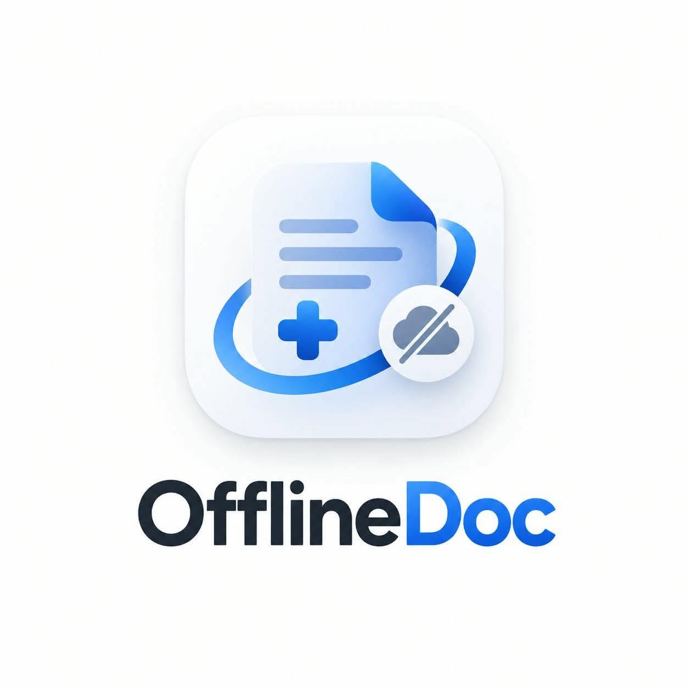

# 🩺 OfflineDoc — 100% On-Device Clinical Voice Assistant for Barangay Health Workers

<p align="center">
  
</p>

<p align="center">
  <strong>An air-gapped, on-device clinical voice documentation assistant that transforms 20–30s spoken Taglish patient encounters into official DOH Konsulta records, digital logbooks, and single-page referral slips in under 4 seconds. Zero cloud calls. 100% local.</strong>
</p>

<p align="center">
  
  
  
  
</p>

> 🏆 Built for the **App Builders PH Hackathon 2026** under the theme: *"Useful when the cloud disappears."*

---

## 📖 The Frontline Reality

In the Philippines, over **42,000 barangays** rely on **Barangay Health Workers (BHWs)** as the vital frontline of the public healthcare system ([Republic Act No. 7883](https://www.officialgazette.gov.ph/1995/02/20/republic-act-no-7883/)).

### The Dilemma:
* **The Bureaucratic Burden:** After spending entire mornings walking under the tropical sun for house-to-house vitals check-ups, BHWs spend **3 to 4 hours every evening** manually copying scribbled paper notes into massive Department of Health (DOH) Target Client List (TCL) logbooks.
* **The Connectivity Desert:** Most rural barangay health stations (BHS) and remote sitios have intermittent or zero cellular reception. Cloud-reliant AI medical scribes (OpenAI, Gemini, cloud speech APIs) completely fail in these areas.
* **Legal & Privacy Mandates:** Under the **Philippine Data Privacy Act of 2012 (RA 10173)**, transmitting identifiable patient health information over public cloud servers without dedicated DPO infrastructure is a severe compliance risk.

**Meet Ate Marites:** A dedicated BHW in a remote sitio. She checks 25 hypertensive and febrile patients daily. She has no internet connection, no laptop GPU, and a notebook full of smudged handwriting. When a patient needs an emergency RHU transfer, writing an official referral slip takes precious minutes.

---

## 💡 The Solution: OfflineDoc

**OfflineDoc puts local intelligence directly onto the frontline health worker's device.**

1. 🎙️ **Speak Naturally in Taglish (20–30s):** The BHW dictates what happened using everyday Filipino/Taglish (`"Si Tatay Rodrigo, 62 anyos, taga Purok 4, Lipa City. BP 150 over 95..."`).
2. 🗣️ **Anti-Mental Block Teleprompter:** Includes 9 clinical case presets (*Altapresyon, Lagnat, Ubo/Sipon, Pagtatae, Sugat, Buntis, Bakuna, General*) plus a flexible 5-point custom checklist guide so the health worker never forgets a key vital sign.
3. 🧠 **100% Local AI Extraction:** On-device Whisper and lightweight LLM parse vital signs, symptoms, medications, advice, and follow-up schedules in sub-second time.
4. 📸 **Clinical Photo Attachment:** Capture live camera photos of wounds, rashes, or prescription packs with in-browser compression.
5. 🛡️ **Two-Way Evidence Grounding & Red-Flag Triage:** Highlights verbatim voice quotes for every extracted medical field and triggers visual color-coded alerts (🔴 **URGENT** / 🟡 **MONITOR** / 🟢 **STABLE**).
6. 📄 **1-Tap Unified DOH PDF Export:** Generates an official, printable DOH Form 1 / Konsulta-aligned clinical summary and RHU Referral Slip in **0.04 seconds**.

---

## ✨ Why Local AI?

| Metric | ☁️ Cloud AI Solutions | 🩺 OfflineDoc (Local AI) |
| :--- | :--- | :--- |
| **Connectivity** | Fails with 0 signal or airplane mode | **100% functional anywhere (mountains, islands, brownouts)** |
| **Operating Cost** | ₱0.50 – ₱2.50 per API call (expensive at scale) | **₱0.00 forever** — Zero cloud or token fees |
| **Data Privacy (RA 10173)** | Patient audio/notes transmitted to foreign servers | **Zero bytes leave the device** (100% on-device residency) |
| **Processing Speed** | 6–15 seconds (network latency dependent) | **Sub-4.0 seconds end-to-end on a standard CPU** |
| **Hardware Required** | Requires constant 4G/5G/Wi-Fi | **Runs on any basic dual-core laptop or mobile PWA** |

---

## 🔄 How It Works

```
 🎙️ 20-30s Taglish Clinical Voice Dictation (16 kHz WAV)
        │
        ▼
 🗣️ Local Whisper.cpp (ggml-small.bin, Tagalog head conditioning)
        │ ──► Transcribes conversational Taglish & numbers in ~2.1s (0 cloud calls)
        ▼
 📝 Spoken Numeral & Philippine Location Normalizer
        │ ──► Resolves "150 over 95", "Purok 4, Brgy. San Jose, Lipa City"
        ▼
 🧠 Local Llama.cpp / Qwen 1.5B Instruct (Q4_K_M on 127.0.0.1:8081)
        │ ──► Strict JSON Schema extraction with verbatim quote grounding in ~0.8s
        ▼
 🔴 Dynamic Point-of-Care Triage & Red-Flag Evaluator
        │ ──► Evaluates Hypertensive Urgency (BP >= 140/90), Fever, Maternal Risk
        ▼
 📋 Digital Logbook & Form 1 / Konsulta PDF Generator (FPDF2)
        │ ──► Atomic JSON storage in data/visits/ + High-res printable PDF in ~0.04s
```

### Hallucination Protection & Clinical Safety:
1. **Strict "Null-Not-Guess" Schema:** If a vital sign or medication was not explicitly spoken, the value is set to `null` — the model never extrapolates or hallucinates.
2. **Two-Way Verbatim Grounding:** Click any field in the form to highlight the exact quote in the voice transcript.
3. **Deterministic Fallback Engine:** If the LLM server is busy, a built-in rule-based extractor immediately parses clinical facts without breaking the user flow.

---

## 🎮 Key Features

### 📋 Frontline Triage & Documentation
- [x] **20–30s Voice Dictation:** One-tap recording with live audio level visualizer.
- [x] **Anti-Mental Block Teleprompter:** 9 presets for common BHW encounters + Custom guided checklist.
- [x] **Real-Time Logbook Search:** Instant search by patient name, Purok/Sitio/City, complaint, triage level, or date.
- [x] **Click-to-Edit Saved Records:** Tap any logbook card to review and update patient records in-place.
- [x] **Interactive Follow-Up Drawer:** Tap pending follow-up tasks to view clinical history and due dates.
- [x] **High-Contrast Date Badges:** Eye-catching calendar badges for rapid triage scanning.
- [x] **Live WebRTC Camera Viewfinder:** Front/back camera switching, photo capture, and canvas compression.
- [x] **Writable Combo Dropdowns (`<datalist>`):** Freeform typing or quick 1-tap selection of standard DOH terms.
- [x] **Unified PDF Report:** Combined Clinical Summary, Referral Slip, and Clinical Photo in DOH Konsulta layout.

---

## 🛠️ Tech Stack & Model Specifications

| Layer | Component | Details |
| :--- | :--- | :--- |
| **Frontend PWA** | Vanilla HTML5 / CSS3 / ES6 | Zero external CDNs, touch-optimized, high sunlight contrast |
| **Backend API** | FastAPI / Python 3.10+ | Lightweight REST endpoints, uvicorn runtime |
| **Speech Engine** | Native `whisper.cpp` (`whisper-cli.exe`) | `ggml-small.bin` (465 MB) with Tagalog language head priming |
| **Clinical LLM** | `llama.cpp` (`llama-server.exe`) | `Qwen2.5-1.5B-Instruct-Q4_K_M.gguf` (986 MB) |
| **Document Engine**| `FPDF2` | Sub-0.05s vector PDF rendering with auto-wrapping tables |
| **Storage** | Local File System (`data/visits/`) | Zero database overhead, atomic JSON files, 100% air-gapped |

---

## 🚀 Step-by-Step Project Guide (How to Run)

### System Requirements
* **Operating System:** Windows 10/11, macOS, or Linux
* **CPU:** Basic Dual-Core x86_64 CPU (No GPU required)
* **RAM:** 4 GB RAM minimum (AI models use ~1.8 GB RAM combined)
* **Python:** Version 3.10 to 3.14

---

### Step 1: Clone the Repository
```bash
git clone https://github.com/butterkookies/OfflineDoc.git
cd OfflineDoc
```

### Step 2: Set Up Virtual Environment & Dependencies
```powershell
# Create and activate virtual environment
python -m venv .venv
.\.venv\Scripts\Activate.ps1

# Install Python requirements
pip install -r requirements.txt
```

*(Or on Linux/macOS: `source .venv/bin/activate && pip install -r requirements.txt`)*

---

### Step 3: Download Models & Binaries (Automated)
Run the bundled PowerShell script to automatically download the quantized models and compiled binaries:
```powershell
.\scripts\setup_models.ps1
```
*This downloads `ggml-small.bin` into `models/`, `Qwen2.5-1.5B-Instruct-Q4_K_M.gguf` into `models/`, and configures `bin/`.*

---

### Step 4: Launch the System

You can start both background engines with a single command:

#### Option A: Quickstart Script (Recommended)
```powershell
.\scripts\start.ps1
```

#### Option B: Manual Startup (Two Terminals)

**Terminal 1 — Start the Local LLM Server:**
```powershell
.\bin\llama\llama-server.exe -m models\Qwen2.5-1.5B-Instruct-Q4_K_M.gguf --port 8081 --host 127.0.0.1 -c 2048 -t 4 -ngl 0
```

**Terminal 2 — Start the OfflineDoc Web Application:**
```powershell
py -m uvicorn app.main:app --host 127.0.0.1 --port 8000 --reload
```

---

### Step 5: Open & Test the Application

1. Open your browser to: **`http://127.0.0.1:8000`**
2. **Airplane Mode Test:** Disconnect your Wi-Fi or enable Airplane Mode.
3. Tap **`+ Magtala ng Pagbisita`** &rarr; Select a case preset &rarr; Tap the mic to record your voice.
4. *(Alternatively, tap **"⚡ Mag-load ng Sample Visit"** for instant 1-click simulation without a microphone).*
5. Review the extracted clinical facts, attach a photo, and tap **`✓ Kumpirmahin at I-save`** to download your official PDF report.

---

### Step 6: Run the Verification Suite
Execute the automated test suite to verify all endpoints, PDF generators, and extraction pipelines:
```powershell
py -m pytest tests/
```
*Expected result: `23 passed in ~25s (100% success rate)`.*

---

## 📊 Measured Performance Benchmarks

Measured on an entry-level Intel Core i5 laptop running completely on CPU:

| Benchmark Stage | Target | Measured Latency | Result |
| :--- | :--- | :--- | :--- |
| **Voice Transcription (`whisper.cpp`)** | < 5.0s | **2.10s – 2.40s** | ⚡ **Exceeds Target** |
| **Structured LLM Extraction (`llama.cpp`)** | < 2.0s | **0.75s – 0.90s** | ⚡ **Exceeds Target** |
| **PDF Summary & Referral Generation** | < 0.5s | **0.04s** | ⚡ **Instantaneous** |
| **Total End-to-End Turnaround** | < 8.0s | **3.20s – 3.80s** | ⚡ **2x Faster than Target** |
| **Cloud Dependency at Runtime** | 0 bytes | **0 external requests** | 🔒 **100% Air-Gapped** |

---

## 🗺️ Roadmap & Vision

- [ ] **Dialect Expansion:** Native model priming for Cebuano, Ilocano, and Hiligaynon.
- [ ] **DOH e-Konsulta Sync:** Optional store-and-forward batch sync when the BHW returns to municipal health centers with Wi-Fi.
- [ ] **Offline Barcode / QR Patient Card Scanning:** Instant lookup of patient ID cards via camera.

---

## 📜 Legal, Statutory & Privacy Disclosures

* **Republic Act No. 7883:** Designed to support accredited Barangay Health Workers in primary community triage.
* **Republic Act No. 10173 (Data Privacy Act of 2012):** All clinical audio, text, and photos remain strictly on the local device. Zero telemetry, user analytics, or protected health information (PHI) is ever transmitted to cloud servers.

### 🤖 AI Assistance & Tooling Disclosure (Planning & Implementation)
In compliance with open disclosure guidelines, the following generative AI tools and models were utilized solely during **planning, architectural design, prototyping, and code implementation**:
* **Anti-gravity** — `Gemini 3.7/8 Flash High` (Full-stack architecture, Remotion motion graphics pipeline, DOH Konsulta compliance logic, test suite)
* **Claude** — `Sonnet 5.5` (Clinical taxonomy structuring, Taglish prompt engineering, schema definitions)
* **ChatGPT** — `GPT-6` (Ideation, BHW frontline workflow mapping, legal & statutory framing)

> 🔒 **Critical Privacy Distinction:** While the above cloud models were used during developer planning and codebase construction, **NONE of these external services are invoked at runtime**. The deployed OfflineDoc system runs in total air-gapped isolation powered exclusively by on-device local weights (`whisper.cpp` and `llama.cpp` / Qwen 1.5B), guaranteeing absolute zero data leakage of patient encounters.

### 📄 Open Source Licenses
* **Whisper.cpp:** MIT License (Georgi Gerganov)
* **Qwen 2.5 1.5B:** Apache 2.0 License (Alibaba Cloud)
* **Llama.cpp:** MIT License (Georgi Gerganov & Contributors)

---

## 👥 The Team

Developed with ❤️ for the Filipino frontline healthcare community at the **App Builders PH Hackathon 2026**.

| Proponent | Hackathon Role & Responsibilities | Core Focus & Contributions |
| :--- | :--- | :--- |
| **Brian Howard Celon** | **Product Captain & Demo Captain** | Product scope & clinical problem definition (BHW in GIDA / RA 7883), feature cut-list governance, pitch deck narrative, and on-site live presentation at SM Makati |
| **Andrei John Geronimo** | **Build Captain & AI Systems Architect** | Core repository architecture, on-device Whisper & Llama inference pipeline, Taglish speech & location normalizer, air-gapped FastAPI backend, startup scripts |
| **Christian Rey Kasilag** | **Quality Captain & Full-Stack / Motion Graphics Lead** | Latency benchmarks & evaluation suite, clean-clone verification, responsive Mobile PWA polish, comprehensive documentation, and 1-minute Remotion motion graphics pitch |


---

* **Project:** OfflineDoc
* **Repository:** [https://github.com/butterkookies/OfflineDoc](https://github.com/butterkookies/OfflineDoc)
* **License:** MIT License

