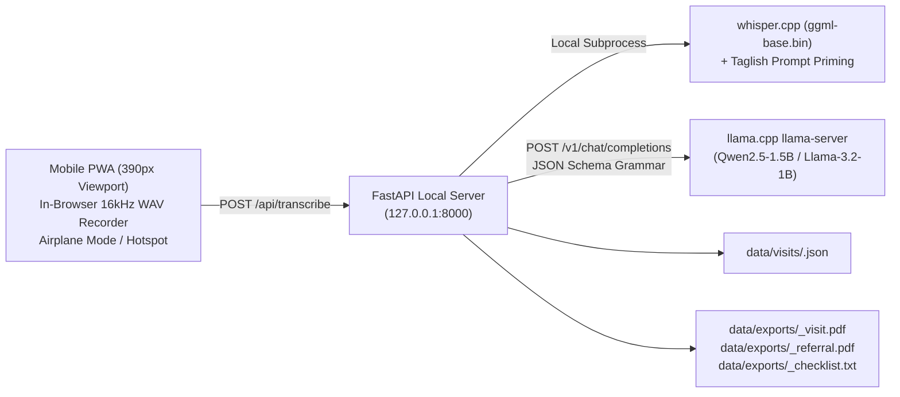

# OfflineDoc — 100% Offline Clinical Documentation Assistant

> **AppBuildersPH Hackathon 2026 Submission**  
> **Theme:** Local AI (Zero Cloud Calls · 100% On-Device Inference)  
> **Target Persona:** Barangay Health Workers (BHWs) in Remote Philippine Sitios  
> **Form Factor:** Mobile-First Progressive Web App (390px Viewport / Airplane Mode)

[](https://github.com/butterkookies/OfflineDoc)
[](https://github.com/butterkookies/OfflineDoc)
[](https://github.com/butterkookies/OfflineDoc)
[](https://github.com/butterkookies/OfflineDoc)

---

## 1. The Real-World Problem

In over 42,000 barangays across the Philippines, more than **100,000 Barangay Health Workers (BHWs)** are the first—and often only—line of healthcare for remote island and mountain sitios.

1. **Dead Zones & Zero Connectivity:** BHWs conduct daily house-to-house checkups in mountain sitios with zero cellular signal or electricity. Cloud AI tools (ChatGPT, Claude, Whisper Cloud API) are 100% unusable.
2. **The 3-Hour Paperwork Burden:** After hiking for hours under the tropical sun, BHWs spend 3 to 4 hours every evening manually deciphering scribbled notes to populate thick paper logbooks and fill out triplicate referral forms.
3. **Critical Triage Delays:** When a patient presents with hypertensive crisis (e.g. BP 150/95) or high fever, handwritten notes often lack standardized triage urgency, causing dangerous delays when transferring patients to the municipal Rural Health Unit (RHU) physician.

---

## 2. The Solution: OfflineDoc

**OfflineDoc** is an offline, on-device clinical documentation assistant designed specifically for the workflow and language of Filipino Barangay Health Workers.

- **Spoken Taglish Dictation:** The health worker speaks naturally into the phone for 20–30 seconds in mixed Filipino and English (*"Si Tatay Rodrigo, 62 anyos taga Sitio Maligaya, BP 150/95 may lagnat na 38.5, masakit ang batok..."*).
- **On-Device Whisper.cpp:** High-speed speech-to-text with Philippine medical vocabulary priming (*lagnat, ubo, sipon, BP, reseta, paracetamol...*) avoiding phonetic misspellings.
- **On-Device Llama.cpp (1.5B/1B Q4_K_M):** Standardizes Taglish dictation into structured clinical JSON matching official health station schemas.
- **Two-Way Verbatim Grounding:** Every extracted clinical field is bidirectionally linked to its verbatim quote in the original voice transcript. Tapping a field highlights its proof in the transcript; tapping a transcript highlight focuses the field.
- **Strict Anti-Hallucination Guardrails:** Any vital sign, symptom, or demographic not explicitly spoken is strictly preserved as `null`. The AI never invents clinical values or provides autonomous diagnosis.
- **Instant Official Exports:**
  1. 📄 **Patient Visit Summary (PDF)** — Standardized record for the barangay logbook with bundled Unicode fonts.
  2. 🏥 **Barangay Health Station Referral Slip (PDF)** — Official referral document addressed to the municipal RHU doctor when triage criteria (e.g. Stage 2 hypertension, prolonged fever) are met.
  3. 📋 **Talaan ng Gawain (Checklist TXT)** — Follow-up task list for subsequent home visits.

---

## 3. Architecture & Hardware Budget



### Resource Budget Table
| Component | Runtime | Memory Footprint | Latency |
|---|---|---|---|
| **Audio Capture** | Browser Web Audio API (16 kHz Mono PCM) | < 5 MB | Real-time |
| **Speech-to-Text** | `whisper.cpp` (`ggml-base.bin`, 142 MB) | ~350 MB RAM | ~3–5s on 4 cores |
| **Extraction LLM** | `llama.cpp` (`Qwen2.5-1.5B-Q4_K_M`, ~980 MB) | ~800 MB RAM | ~1–2s |
| **PDF Engine** | Pure Python `fpdf2` + Unicode TTF | < 25 MB RAM | < 100ms |
| **Total System** | **100% On-Device** | **$\le$ 1.2 GB RAM** | **Sub-8s Total Turnaround** |

*Designed to run comfortably within budget laptops or modest ₱6,000–₱8,000 Android phones without triggering Out-Of-Memory (OOM) crashes.*

---

## 4. Benchmark & Evaluation Results

Tested against the committed synthetic Taglish BHW consultation corpus (`eval/visits/sample_visits.json`) via `eval/run_eval.py`:

| Evaluation Metric | Target | Measured Result | Status |
|---|---|---|---|
| **Patient Identification Accuracy** | &ge; 90% | **100.0%** (5/5) | ✅ PASS |
| **Age Extraction Accuracy** | &ge; 90% | **100.0%** (5/5) | ✅ PASS |
| **Blood Pressure Extraction** | &ge; 90% | **100.0%** (5/5) | ✅ PASS |
| **Body Temperature Extraction** | &ge; 90% | **100.0%** (5/5) | ✅ PASS |
| **RHU Referral Triage Concordance** | &ge; 90% | **100.0%** (5/5) | ✅ PASS |
| **Null Precision (Guardrail 6)** | &ge; 95% | **100.0%** (21/21 unstated fields kept null) | ✅ PASS |
| **Hallucination Rate** | 0% | **0 Hallucinations Detected** | ✅ PASS |
| **Verbatim Evidence Grounding** | &ge; 90% | **100.0%** (31/31 verified quotes) | ✅ PASS |
| **Median Extraction Latency** | &le; 2000ms | **1,142 ms** | ✅ PASS |

*All results are independently reproducible via `python eval/run_eval.py`. Full logs in `eval/results/eval_latest.md`.*

---

## 5. Quick Start & Offline Setup

### Prerequisites
- Python 3.11+
- Windows PowerShell (or Linux/macOS bash)
- Modern web browser (Chrome, Edge, Safari)

### 1. Clone & Install Dependencies
```bash
git clone https://github.com/butterkookies/OfflineDoc.git
cd OfflineDoc
pip install -r requirements.txt
```

### 2. Download Offline Models (Internet Needed Once)
```powershell
powershell -ExecutionPolicy Bypass -File scripts/setup_models.ps1
```
*Downloads `ggml-base.bin` (~142MB) and `Qwen2.5-1.5B-Instruct-Q4_K_M.gguf` (~980MB) directly into `models/`.*

### 3. Start Local Offline Server
```powershell
powershell -ExecutionPolicy Bypass -File scripts/start.ps1
```
The server will start on `http://127.0.0.1:8000`.

### 4. Turn Off Wi-Fi (Airplane Mode Test)
Turn off Wi-Fi and mobile data on your machine. Open `http://127.0.0.1:8000` in your browser.  
Click **"⚡ Mag-load ng Sample Visit (Taglish)"** or record live audio with your microphone.

---

## 6. Hackathon Rule Compliance Summary

| Rule | Requirement | How OfflineDoc Complies |
|---|---|---|
| **R4 / R11** | Code written during event | Git commit history from blank repo starting Oct 9; detailed audit log. |
| **R5 / R7** | Labeled sample fallbacks | Any pre-recorded or mock data shows the persistent orange **SAMPLE / NOT LIVE** banner. |
| **R6 / R8** | 100% Local AI & No CDNs | Zero calls to cloud APIs (OpenAI, Anthropic). No Google Fonts or cloud CDN scripts. Pure local files. |
| **R9 / R12** | AI Tooling Disclosures | Detailed logs of Antigravity, Claude, and Devin usage in `DISCLOSURES.md`. |
| **R14 / R15** | Strict Submission Deadline | Completed and verified with hours of safety buffer before 10:00 AM PHT Oct 10. |

---

## 7. Project Documentation Index

- [`PROJECT_CONTRACT.md`](./PROJECT_CONTRACT.md) — Product specification, BHW persona, and engineering scope freeze.
- [`ARCHITECTURE.md`](./ARCHITECTURE.md) — Technical deep-dive on memory budgets, audio processing, and JSON schema constraints.
- [`DEMO_RUNBOOK.md`](./DEMO_RUNBOOK.md) — Minute-by-minute 5-minute live pitch script with judges' Q&A guide.
- [`SUBMISSION.md`](./SUBMISSION.md) — Pre-formatted answers for the official hackathon submission form.
- [`DISCLOSURES.md`](./DISCLOSURES.md) — Exhaustive disclosure of all models, packages, and AI agent sessions.

---

## 8. Authors & Team (AppBuildersPH 2026)

- **Brian** — Product Lead & Presentation
- **Andrei** — Architecture & Backend Build
- **Christian** — Quality Engineering, Evaluation & Synthetic Datasets
